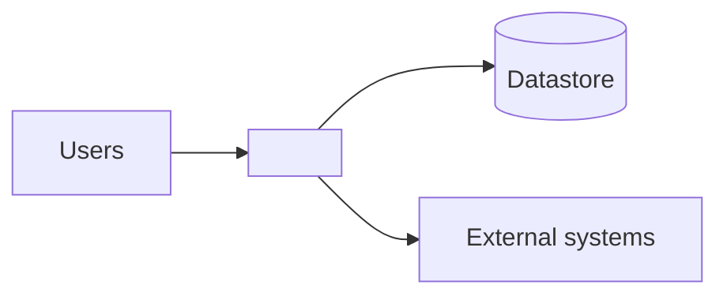

# Current Architecture

> **Last updated:** YYYY-MM-DD
> **Scope:** As-is architecture of <system>
> **Mode:** full | code-only
> **Status:** accepted knowledge unless flagged — see ../_discovery/assumptions-register.md

<!-- As-is only. Describe how the system IS built, not how it should be. Keep to ~1–2 pages
plus one diagram. -->

## Overview

<2–4 sentences: style (monolith/services/etc.), primary stack, how it's driven.>

## Context diagram

## Components

<!-- The load-bearing parts only. What each is responsible for. A small table is ideal. -->

| Component | Responsibility | Key tech |
|---|---|---|
| <name> | <what it does> | <framework/lib> |

## Data & persistence

<Datastores, what lives where. Point to domain-model.md for the entities.>

## Entry points & runtime

<How it runs: web app, workers, scheduled jobs, CLI. How requests/events flow in.>

## Cross-cutting concerns

<Auth, logging/audit, error handling, config/secrets, caching — briefly, as-is.>

## Notable constraints & risks

<Tech debt, coupling, single points of failure a new joiner must know. Flag assumptions.>
