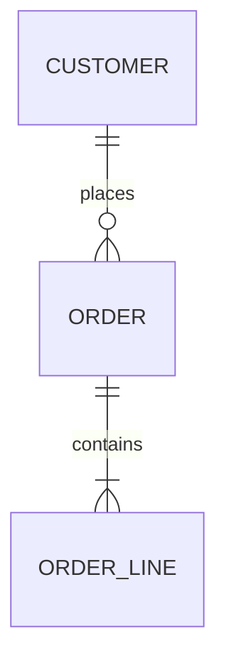
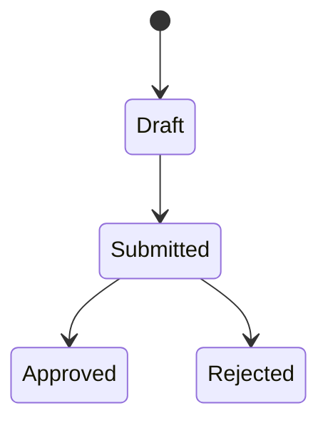

# Domain Model

> **Last updated:** YYYY-MM-DD
> **Scope:** Core domain entities and relationships of <system>
> **Mode:** full | code-only
> **Status:** accepted knowledge unless flagged — see ../_discovery/assumptions-register.md

<!-- The business entities and how they relate — not the raw DB schema. ~1–2 pages + a diagram. -->

## Entity diagram

## Core entities

| Entity | Meaning | Key attributes | Related to |
|---|---|---|---|
| <name> | <what it represents in the business> | <notable fields> | <relationships> |

## Key lifecycles

<!-- For entities with a status/state, show the states and transitions. State machines are
where a lot of business rules live. -->

<Notes on what triggers each transition and who can cause it. Cross-link business-rules.md.>
