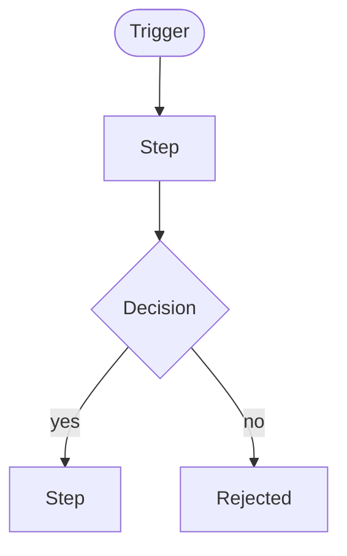

# Workflows

> **Last updated:** YYYY-MM-DD
> **Scope:** Key end-to-end processes in <system>
> **Mode:** full | code-only
> **Status:** accepted knowledge unless flagged — see ../_discovery/assumptions-register.md

<!-- The key business/process flows only, each with a diagram. For each: actors, trigger,
main path, decision points, unhappy paths, hand-offs, SLAs. -->

## <Workflow name>

**Actors:** <who> · **Trigger:** <what starts it> · **Outcome:** <what success looks like>

- **Decision points:** <what determines each branch>
- **Unhappy paths:** <errors, timeouts, rejections, retries>
- **Hand-offs / approvals:** <where a human or another system takes over>
- **Timing / SLAs:** <cut-offs, deadlines — or [assumption] if unknown>

## <Next workflow>

<...>
