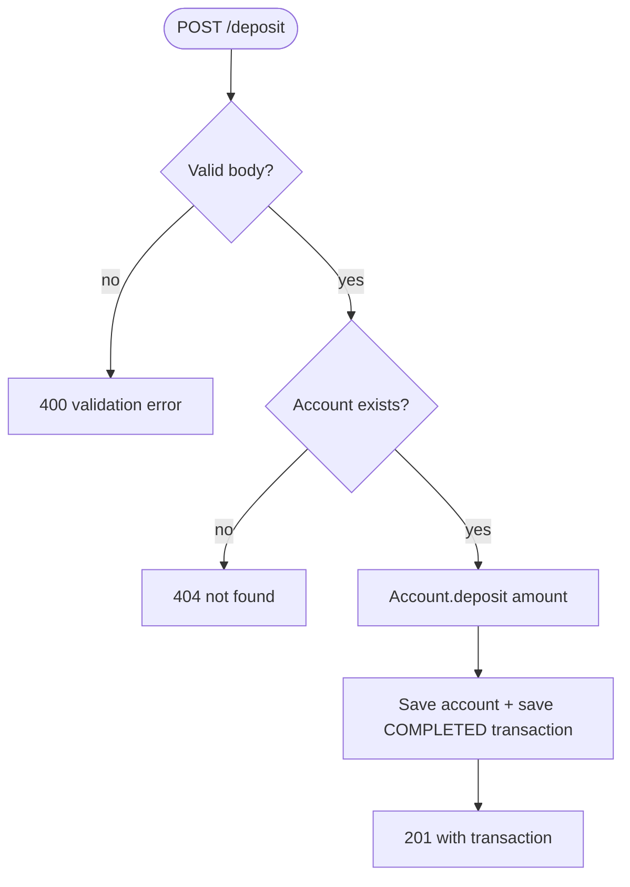
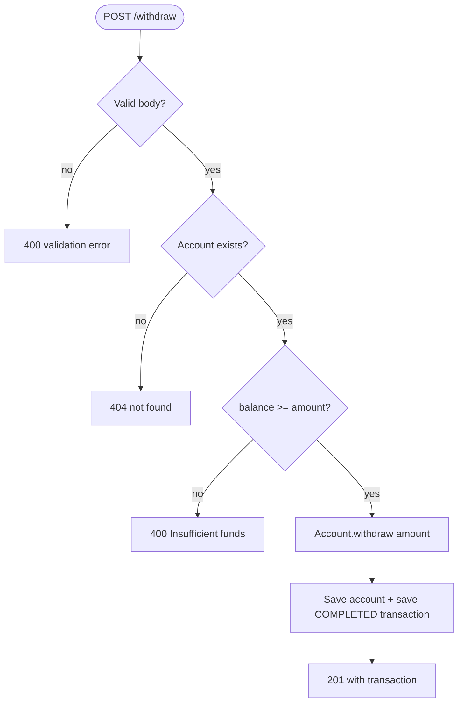
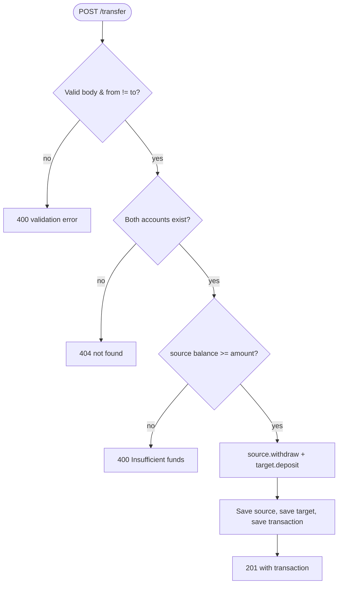

# Workflows

> **Last updated:** 2026-07-20
> **Scope:** Key end-to-end money-movement processes in the banking service
> **Mode:** full
> **Status:** accepted knowledge unless flagged — see ../_discovery/assumptions-register.md

All flows are synchronous REST calls. There are no background jobs, queues, schedules, or human
approval steps. Each request flows: **Controller** (validate + shape response) →
**Application service** (load accounts, orchestrate) → **Domain `AccountService`** (apply the
rule, build the transaction) → **Repositories** (persist).

## Deposit

**Actors:** API caller · **Trigger:** `POST /api/transactions/deposit` · **Outcome:** account
balance increased and a COMPLETED transaction recorded.

- **Decision points:** body validation (Joi); account existence.
- **Unhappy paths:** invalid body → 400; unknown account → 404; other errors → 400/500.

## Withdrawal

**Actors:** API caller · **Trigger:** `POST /api/transactions/withdraw` · **Outcome:** balance
decreased and a COMPLETED transaction recorded — or rejection if funds are insufficient.

- **Decision points:** validation; account existence; the **no-overdraft** check.
- **Unhappy paths:** insufficient funds → 400 "Insufficient funds"; unknown account → 404. The
  transaction is marked FAILED in memory but is not persisted (A-4).

## Transfer

**Actors:** API caller · **Trigger:** `POST /api/transactions/transfer` · **Outcome:** amount
debited from the source and credited to the target, with a COMPLETED transaction recorded.

- **Decision points:** validation incl. distinct accounts; both accounts exist; no-overdraft on
  the source.
- **Unhappy paths:** unknown source/target → 404; insufficient funds → 400.
- [risk] **Not atomic** (A-1): source and target are saved in separate operations with no
  database transaction — a failure between the two saves can leave balances inconsistent.

## Supporting read flows

- **Create account** — `POST /api/accounts` (name only; opens at zero balance).
- **List / get account** — `GET /api/accounts`, `GET /api/accounts/:id`.
- **Account transaction history** — `GET /api/accounts/:accountId/transactions`, returning
  every transaction where the account is the source or the target, newest first.
