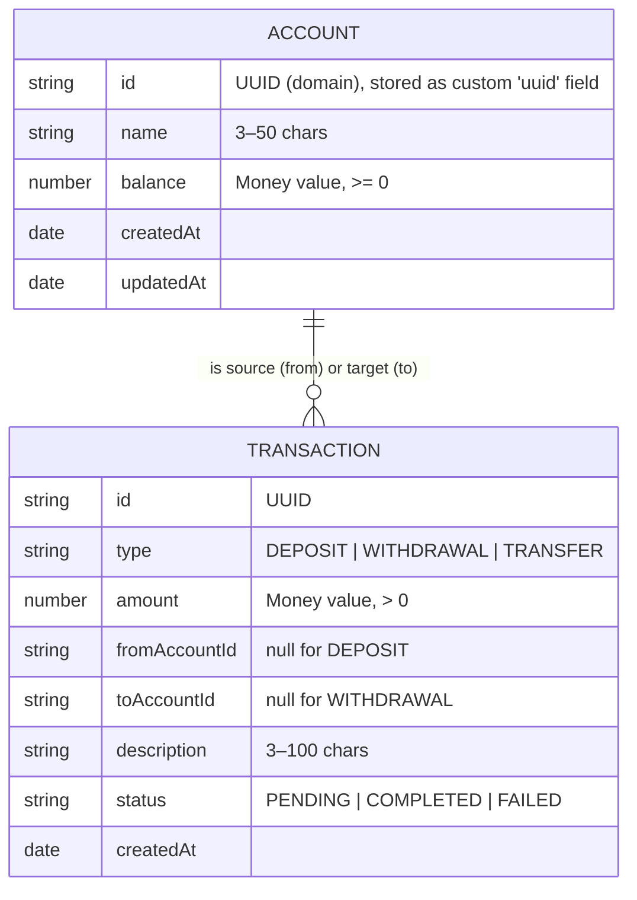
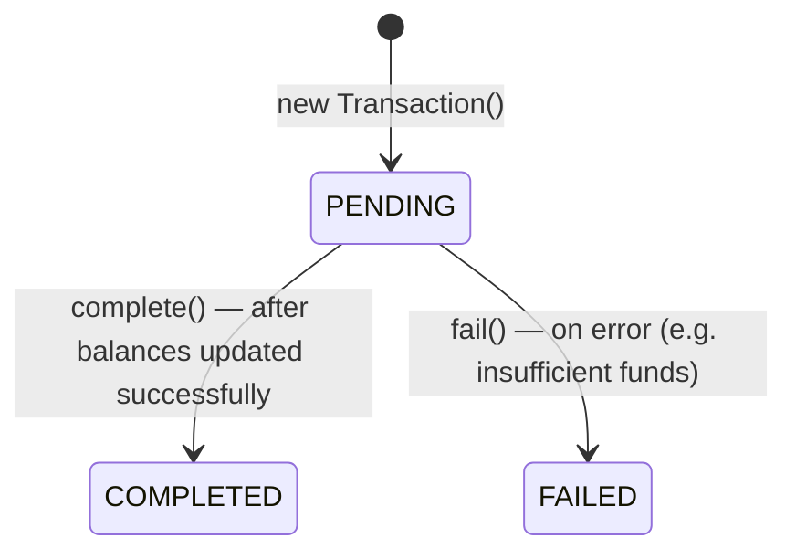

# Domain Model

> **Last updated:** 2026-07-20
> **Scope:** Core domain entities, value objects and lifecycles of the banking service
> **Mode:** full
> **Status:** accepted knowledge unless flagged — see ../_discovery/assumptions-register.md

The domain is small: **Accounts** hold a balance, and **Transactions** record every movement
of money (a deposit into an account, a withdrawal out of one, or a transfer between two).
**Money** is a value object shared by both.

## Entity diagram

There is no enforced foreign-key relationship in MongoDB — a transaction stores account ids as
plain strings (the accounts' domain UUIDs), and `findByAccountId` matches a transaction where
the account is *either* the source or the target.

## Core entities

| Entity | Meaning | Key attributes | Related to |
|---|---|---|---|
| **Account** | A bank account with an owner name and a running balance | `id`, `name`, `balance` (Money), `createdAt`, `updatedAt` | Referenced by Transactions as `fromAccountId` / `toAccountId` |
| **Transaction** | An immutable record of one money movement | `type`, `amount` (Money), `fromAccountId`, `toAccountId`, `description`, `status`, `createdAt` | Points to one or two Accounts |
| **Money** (value object) | An amount of money, rounded to 2 decimal places, immutable; supports add/subtract/compare | `value: number` | Held by Account.balance and Transaction.amount |

Money carries **no currency** — it is a single implicit currency (see risk A-3).

## Account lifecycle

An Account today has no status field — it exists from creation onward; only its `balance`
changes. Account types and a lifecycle (open/frozen/closed) are intended but not implemented
(see A-7).

## Transaction lifecycle

Every transaction is constructed as `PENDING`, then moved to a terminal state.

The transition is driven by the domain `AccountService`: it constructs the transaction, applies
the balance change, and calls `complete()` on success or `fail()` on error. Note that in the
current application-service flow a failed operation throws before the transaction is saved, so
**FAILED transactions are not persisted** — in practice the datastore only ever holds
COMPLETED transactions (see A-4).

See [business-rules.md](./business-rules.md) for the rules governing each transition and
[../business/workflows.md](../business/workflows.md) for the end-to-end flows.
