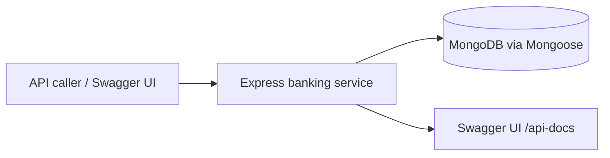

# Current Architecture

> **Last updated:** 2026-07-20
> **Scope:** As-is architecture of the banking service
> **Mode:** full
> **Status:** accepted knowledge unless flagged — see ../_discovery/assumptions-register.md

## Overview

A single Express + TypeScript HTTP service following a layered **Domain-Driven Design** split:
API → Application → Domain → Infrastructure. It exposes a small REST API for accounts and money
movements, persists to MongoDB via Mongoose, and documents itself with Swagger UI. It is driven
entirely by synchronous HTTP requests — no workers, queues, or schedulers.

## Context diagram

## Layers & components

| Layer / component | Responsibility | Key tech |
|---|---|---|
| **API** (`src/api`) | Route definitions, controllers, request validation, error handling, Swagger | Express, Joi, swagger-jsdoc |
| **Application** (`src/application`) | Use-case orchestration: load accounts, call the domain, persist, map to DTOs | TypeScript |
| **Domain** (`src/domain`) | Entities (`Account`, `Transaction`), `Money` value object, and `AccountService` holding deposit/withdraw/transfer logic and transaction lifecycle | TypeScript |
| **Infrastructure** (`src/infrastructure`) | Mongoose schemas, repositories, DB connection, config | Mongoose, dotenv |
| **Bootstrap** (`src/server.ts`) | Wires middleware, routes, Swagger, connects to Mongo, starts listening | Express |

Note the deliberate split within the "service" concept: the **domain `AccountService`** owns the
business logic and transaction state changes, while the **application services**
(`AccountApplicationService`, `TransactionApplicationService`) own orchestration and persistence.
The transaction application service delegates its deposit/withdraw/transfer logic to the domain
`AccountService`.

## Data & persistence

MongoDB via Mongoose, two collections: `Account` and `Transaction`. Domain entities carry a
UUID (`uuid` npm package); this is stored in a **custom `uuid` field** and used for all lookups,
kept separate from Mongo's own `_id`. Repositories map between Mongoose documents and domain
entities. Transaction account references are stored as **plain strings** (the account UUIDs),
not Mongo ObjectIds, and there is no DB-level foreign key. See
[../domain/domain-model.md](../domain/domain-model.md).

## Entry points & runtime

- **Endpoints:**
  - `GET /api/accounts`, `GET /api/accounts/:id`, `POST /api/accounts`,
    `GET /api/accounts/:accountId/transactions`
  - `POST /api/transactions/deposit`, `.../withdraw`, `.../transfer`
- **Docs:** Swagger UI at `/api-docs`, spec JSON at `/api-docs.json`.
- **Responses:** controllers wrap payloads in `{ success: true, data }` (or
  `{ success: false, message, error }` on failure) — an envelope not reflected in the older
  design docs.
- **Runtime:** `npm run dev` (ts-node + nodemon) or `npm run build && npm start`. MongoDB runs
  via `docker-compose` (service `mongo`, plus `mongo-express` admin UI on 8081).

## Cross-cutting concerns

- **Security:** `helmet` and `cors()` (open) are applied. **No authentication or authorization**
  — a `bearerAuth` scheme is declared in Swagger but never enforced (risk A-2).
- **Validation:** Joi schemas at the controller boundary; domain entities re-validate invariants.
- **Error handling:** a global `errorHandler` and `notFoundHandler`; controllers also translate
  domain errors to 400/404 by inspecting the message text.
- **Config/secrets:** `dotenv` via `src/infrastructure/config/config.ts`; `.env` holds `PORT`,
  `MONGO_URI`, `NODE_ENV` (credentials are committed demo defaults).
- **Logging:** `morgan('dev')` request logs; `console.error` for errors. No structured
  logging/audit.

## Notable constraints & risks

- [risk] **Non-atomic transfers** — debit and credit are separate saves, no DB transaction (A-1).
- [risk] **No auth** — every operation is unauthenticated (A-2).
- [risk] **Money has no currency** — single implicit currency (A-3).
- [unverified] **FAILED transactions are never persisted** (A-4).
- [unverified] **`AccountRepository.delete()` looks up by `_id`** while all other methods use
  `uuid`; not currently exposed via any route (A-5).
